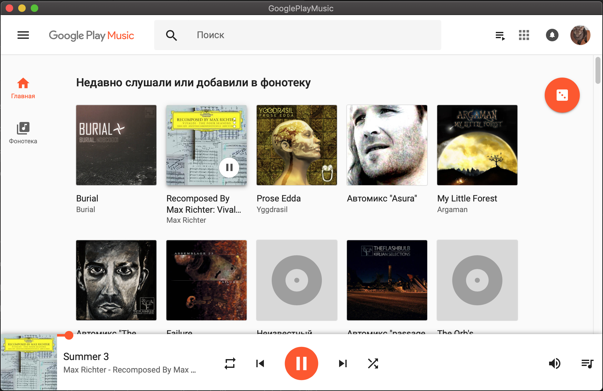

## Google play music


Simple wraper for google play music site. Run as standalone app in mac

Instructions how to build on windows/linux/mac: https://github.com/zserge/webview#distributing-webview-apps

For MacOS - run:
```
 go build -o googleplaymusic.app/Contents/MacOS/googleplaymusic
 zip -r googleplaymusic.zip googleplaymusic.app
```
Builded version (mac):  [release/googleplaymusic.zip](https://github.com/recoilme/googleplaymusic/blob/master/release/googleplaymusic.zip)

Screenshot:

